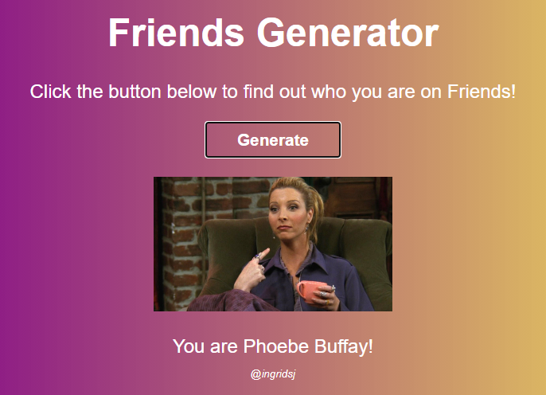

# Friends-Generator
 A simple generator of random images on a web page using JavaScript and HTML.

In this project, images and names of the characters from Friends sitcom will be displayed randomly with each click on the "Generate" button. I am very proud of this project, because I learned about the conditional switch/case structure and what it is and how to use an array. 